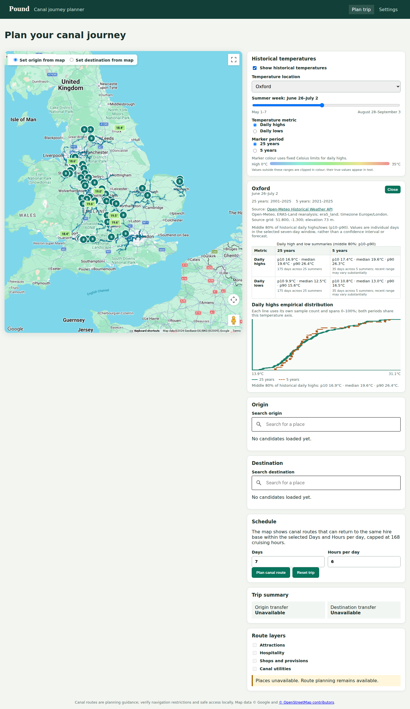

# Historical summer temperature overlay

- Date: 2026-09-05
- Status: Implemented ten-location pilot
- Scope: Location-based summer temperature distributions over both 25 and 5 years.

## Goal and defaults

Help users compare the temperatures historically experienced at UK destinations in a
selected summer week. Show daily maximum and daily minimum temperature distributions,
each with a median and central 80% historical range (10th–90th percentiles).
These are distributions of individual days, not weekly averages or confidence intervals
for a mean. They do not promise that a future day, or an entire trip, falls inside the range.

Use 25 complete calendar years and the latest 5 of those same years. Both windows end in
the same year E: E-24 through E and E-4 through E. Target 2001–2025 and 2021–2025 if
source completeness is verified. Never silently substitute different ending years by
location. The periods overlap; comparisons are descriptive, not independent samples or
an estimate of climate-change attribution. Update the common ending year annually.

Assumption carried forward from exploration: highs and lows are the primary metrics.
Whole-week averages, daytime-hour temperatures, forecasts and trend adjustment are deferred.

## Data approach and decision gate

Start with Open-Meteo's historical API, explicitly selecting ERA5-Land for a consistent
multidecade source. Fetch daily maximum and minimum 2 m air temperatures by coordinate,
with a pinned Europe/London day definition and Celsius units. Record returned grid
coordinates, elevation, requested coordinates, timezone and query settings. Treat the
source as reanalysis, not a thermometer reading at the named town. Different nearby
places may resolve to the same source cell; disclose this rather than invent differences.

A pilot uses Oxford, Birmingham, Worcester, Chester, York, Edinburgh, Cardiff and Belfast,
plus a small selection of active hire bases. The initial production release supports an
explicit, versioned list of named UK towns and hire bases. It does not claim arbitrary-point
coverage. Expansion to arbitrary map clicks requires a land-grid artifact, coverage masks
and a separately assessed download/rendering budget.

Before scaling, measure provider call accounting, acquisition time, completeness, source
cell reuse and observed payload size. Verify the hosted API usage tier against intended use;
retain required data attribution. Chunk requests into resumable annual batches, retry
transient errors with bounded backoff, and respect provider rate limits. Cache raw responses
under data/climate/; never commit them or keys. Fetch only during offline ingest.

HadUK-Grid is the alternative for a finer UK-specific layer: 1 km observation-informed
land grids with daily maximum/minimum data from 1960 under the Open Government Licence.
Its NetCDF processing and acquisition are more involved. Evaluate a small sample before
adopting it; a switch requires rebuilding both windows from the same version, not mixing
sources between periods. Its 0900 UTC maximum/minimum observation windows differ from
local calendar days and must be documented. Neither grid spacing guarantees site accuracy.

## Calendar and statistical contract

Expose 17 fixed seven-day windows starting May 1, May 8, ... through August 21–27,
plus August 28–September 3 (18 windows total). Labels use month/day ranges, not ISO week
numbers, so matching dates remain stable across years. Fetch through September 3 for the
last window. Leap days are outside the supported season. The slider selects these fixed
windows; arbitrary departure-date windows are deferred.

For each location, window, metric and period, collect seven daily values per year.
Require all seven finite values for a year to contribute to that metric. For release,
require all 25 or all 5 eligible years respectively; otherwise that period/metric is
unavailable with explicit missing-year metadata. Never fill missing temperatures with zero,
shorten a requested period, or change its denominator silently. A valid five-year result
may remain available when the 25-year result lacks earlier data.

A complete 25-year result contains 175 daily values; a five-year result contains 35.
Calculate quantiles on sorted unrounded values with linear interpolation:
index = (n - 1) * p, interpolating between floor(index) and ceil(index).
Retain Celsius precision internally; display medians and percentile endpoints to one decimal.
Validate finite values, dates, duplicate days, and paired minimum <= maximum on ingestion.

Retain sorted daily values in the artifact to support an empirical cumulative distribution
(ECDF), rather than fitting a normal curve or smoothing a small five-year sample. Each ECDF
uses its own sample count and spans 0–100%, making unequal sample sizes comparable.
Both periods share a temperature axis. The recent five years are a subset of the baseline.

The UI labels the range 'Middle 80% of historical daily highs/lows'. Five-year results
include 'Based on 35 days across 5 summers; recent range may vary substantially.' Daily
values within a summer are correlated; 35 values are not 35 independent summers.
No inferential confidence band is included in version one. If added later, resample whole
years and evaluate whether five years supports the proposed inference.

## User experience

Add a 'Historical temperatures' layer, off by default, with compact controls in the planner
sidebar (expanded only when enabled):

- A May–August week slider showing actual dates, initially June 26–July 2 (the window containing July 1).
- A Daily high / Daily low selector (high by default).
- A 25 years / 5 years selector controlling marker colour (25 by default).
- A fixed Celsius colour legend for each metric, held constant across periods and weeks.
  The pilot supports fixed 0–35°C limits for highs and -5–25°C for lows; clamp outliers
  visibly and retain their true values in text. Do not rescale each frame.

Use dedicated temperature markers for the configured named locations, restricted to the
viewport and decluttered deterministically at low zoom. Marker text/tooltips expose place,
median, selected years and range; colour is never the only encoding. Retain hire-base and
route marker interactions. Enabling or changing weather must not refit the map.

An accessible location selector lists all configured locations, including those outside the
viewport or omitted by decluttering. Selecting it or a temperature marker opens a panel
showing both periods side by side for both
highs and lows, their sample counts, source and period dates. The distribution view uses
two distinguishable ECDF lines for the selected metric, with p10/median/p90 values repeated
in an accessible table. Unavailable periods are labelled explicitly; do not render them
as zero or borrow the other period's colour. An existing selected place can link to a
configured climate location only when it is an explicit match, not an undisclosed nearest
city estimate.

Keep climate controls/state independent of routing duration and boat settings. A failed
refresh retains the last valid overlay only for the same selected climate query; if the
week or metric changes, clear mismatched data and show a retryable unavailable state.
Discard obsolete responses; support detach/remount and marker/listener cleanup. Same-week
details already contain both metrics and periods, so retain them when switching the map
metric/period; week changes clear details. Detail loading never repaints unchanged markers.

## Artifact and API

Use a separate versioned JSON climate artifact, initially uncompressed on disk. Runtime
responses send only requested summaries or one location detail; no full artifact is sent. It contains source/license metadata, build timestamp, source
settings, common period endpoints, calendar definitions, configured locations and summaries.
Each summary contains availability, missing years, n_days, n_years, p10, median, p90 and
sorted daily values. Store the complete 25-year raw daily history in the offline cache so
future rebuilds need not download it again. The artifact is independent of graph revision.

At 500 locations and 18 windows there are 36,000 period/metric summary combinations,
and at most 3,780,000 stored sample values (500 * 18 * 2 * (175 + 35)). Measure serialized
size and resident memory during the pilot; this estimate is not a payload-size claim.
Do not send all sample arrays with map summaries.

Add optional POUND_CLIMATE_PATH. Validate and load once at startup; a missing or invalid
climate artifact marks climate unavailable without blocking routing. Log the reason and
return 503 climate_unavailable for climate endpoints, without leaking filesystem details.

Proposed read-only endpoints:

- GET /api/climate/locations?week_id=0&period_years=25&metric=high
  returns all configured locations and selected summaries, without sample arrays, plus
  artifact revision, selected period and week metadata. Limit artifact locations to 500
  for the initial release; validate this bound at build and load. The browser filters the
  bounded collection by viewport, avoiding a second server spatial index.
- GET /api/climate/locations/{location_id}?week_id=0
  returns both metrics and periods with samples and provenance for one location.

Validate week_id 0–17, period_years in {5,25}, metric in {high,low}; unknown location is 404.
Return explicit per-summary availability for incomplete data, distinct from service errors.
Use artifact revision for ETags/cache invalidation; update the artifact atomically. All
runtime queries are pure reads with no provider calls or raw-cache access.

## Implementation boundaries

Network importer: packages/pound-build/src/pound_build/ingest/climate.py. Pure aggregation and artifact build/load:
packages/pound-core/src/pound/climate/ (a dedicated domain, not routing or graph functionality). Shared API models:
packages/pound-core/src/pound/schemas.py. Runtime endpoint/config integration: packages/pound-web/src/pound_web/{api,config,app}.py.
CLI build utility: scripts/build_climate.py. A checked-in, non-sensitive location manifest
can live at config/climate-locations.json; downloaded/generated data remain ignored.

Frontend: web/src/lib/types.ts and api.ts; dedicated stores/climate.ts; component controls
and detail panel; MapView contract and Google adapter gain a dedicated marker group.
App.svelte composes the layer with the existing map lifecycle. Preserve concurrent work in
these files and re-read current contracts before implementation.

## Verification and delivery

Test fixed dates, period boundaries, missing complete-year handling, explicit quantile
examples, ECDF normalization, corrupt artifacts, and no request-time network calls. Test
API validation/availability and that routing still works without climate data. Frontend
coverage includes both periods, axis/legend stability, latest-response handling, remount,
cleanup, accessible values and unchanged viewport on layer updates. Manually inspect a
real-source pilot before expanding locations; report acquisition and artifact-size results.

Ship in stages: statistical pipeline and pilot; API and comparison panel; map markers and
controls; scale the location manifest after pilot review. A shaded UK-wide grid and
HadUK-Grid migration are follow-on decisions, not prerequisites for useful town markers.

Do not commit the disposable implementation plan. Move this design to docs/completed/
with the implementation PR. Do not commit raw weather data or generated artifacts.

## Sources

- Open-Meteo historical API: https://open-meteo.com/en/docs/historical-weather-api
- Hosted API usage: https://open-meteo.com/en/pricing
- HadUK-Grid overview: https://www.metoffice.gov.uk/research/climate/maps-and-data/data/haduk-grid/overview
- HadUK-Grid variables/license: https://www.metoffice.gov.uk/research/climate/maps-and-data/data/haduk-grid/datasets

Sources were checked during the preceding exploration. Reconfirm access terms and available
complete years at acquisition time.

## Pilot verification (2026-09-05)

- Acquired 250 seasonal batches (ten locations × 25 years), covering May 1–September 3
  for 2001–2025. The elapsed interval between first and last cache writes was 291 seconds.
- All 720 distributions are available; ten distinct returned source cells. The artifact
  is 1,937,736 bytes after adding build provenance. A standalone load took approximately
  36 ms; total process peak RSS was about 41 MiB (not an incremental-memory benchmark).
- The default ten-location summary response was 2,757 bytes; Oxford detail was 3,199 bytes.
  Local response timings were 4.6 ms and 1.3 ms respectively, not performance guarantees.
- Oxford, June 26–July 2: 25-year daily highs median 19.6°C, p10–p90 16.9–26.4°C;
  five-year daily highs median 19.6°C, p10–p90 17.4–26.3°C. Daily-low medians were
  12.5°C and 13.0°C respectively. Values are ERA5-Land-derived historical data.
- Verified live Google map marker selection and both-period details on localhost:5173
  using real climate and routing artifacts, and exercised period/metric switches.
  Alternate preview origins were rejected by the existing key's referrer restrictions.
- API tests cover optional/invalid climate data preserving routing, configured artifact
  startup, absent runtime network/cache access, query validation, both detail periods,
  and query-specific ETags. Browser review led to sidebar controls, stable marker painting,
  raised climate marker order and an accessible location selector for crowded maps.
- A 390px mobile preview retains an existing wider-page layout even with climate disabled;
  the new comparison panel is readable, but overall mobile layout remains a separate issue.
- Cache envelopes created before the final provenance addition have no fetched_at value;
  they remain readable as unknown acquisition time. New fetches record UTC timestamps.
  Artifact built_at is UTC and excluded from the content hash so cache-only rebuilds
  retain the same revision for identical climate data.

Verification after integrating the current workspace/package layout: 926 Python tests
passed (23 optional tests skipped), 241 frontend tests passed, Svelte/type check clean,
and production web build succeeded. Repository-wide Ruff passes after removing obsolete
bytecode directories left by the package-layout rebase. The browser
pilot and screenshot above were captured before integrating the updated main layout. The existing jsdom navigation stderr remains in the frontend suite.

